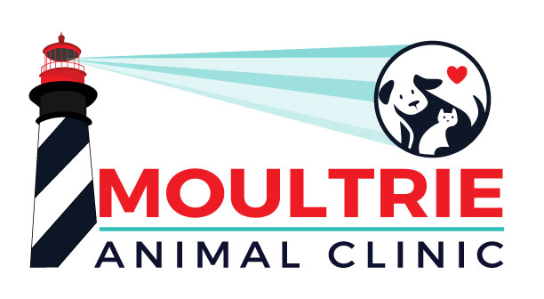

  

# Moultrie Animal Clinic Website

This repository contains the source code for the Moultrie Animal Clinic website, a veterinary practice located in St. Augustine, Florida. The website is built using modern web technologies to provide an informative and user-friendly experience for pet owners.

## Technologies Used

- [Next.js](https://nextjs.org/)
- [React](https://reactjs.org/)
- [Tailwind CSS](https://tailwindcss.com/)
- [shadcn/ui](https://ui.shadcn.com/)
- [TypeScript](https://www.typescriptlang.org/)
- [Contentful](https://www.contentful.com/)
- [Vercel](https://vercel.com/)
